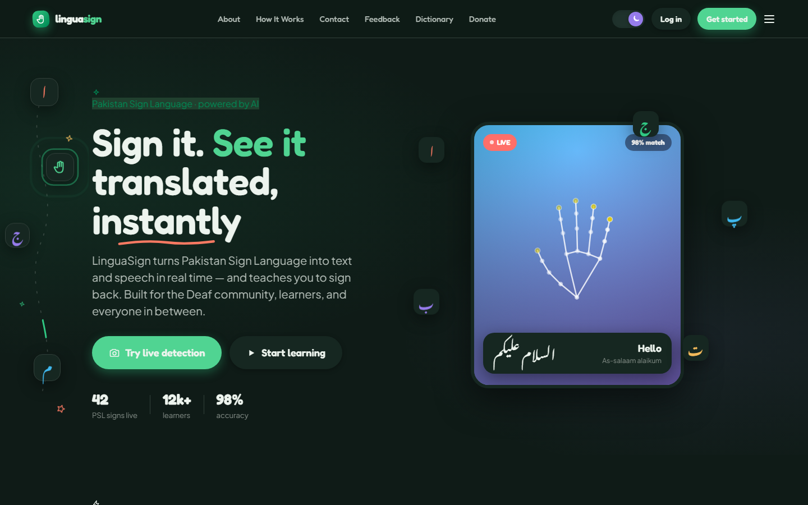
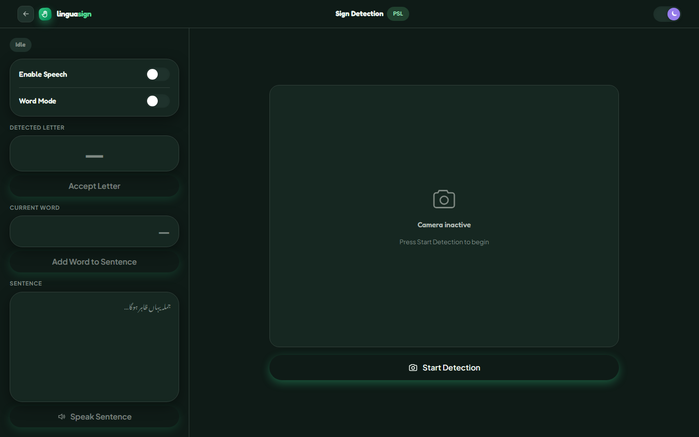

# LinguaSign — Pakistan Sign Language Detection System

A real-time Pakistani Sign Language (PSL) recognition system that translates hand gestures into Urdu text and speech, with a full learning platform built on top.

---

## Application Overview

### Landing Page



The landing page introduces LinguaSign to new visitors with a bold hero section — a full-bleed animated background with a live hand-skeleton preview demonstrating PSL detection in real time. The headline communicates the core value proposition immediately: *Sign it. See it translated, instantly.* Below the fold, trust indicators display the system's reach (users, detections, accuracy), followed by a feature highlights section and navigation links to the core platform modules. The top navigation provides direct access to all major sections — Detect, Learn, Contact, and Feedback — with a persistent theme toggle and a prominent **Try the Detector** call-to-action. The overall aesthetic uses a dark base with a green accent system, reflecting the PSL branding throughout.

---

### Sign Detector



The Sign Detector is the core feature of LinguaSign. Upon starting a session, the system opens the user's webcam via the FastAPI backend and begins streaming a live MJPEG feed. A MediaPipe-powered model analyses each frame in real time, extracting 63 hand keypoints (21 landmarks × XYZ coordinates) and passing them through a trained dense neural network to classify the current PSL hand sign. The detected letter is displayed immediately in the **Detected Letter** panel. Users can then:

- **Accept a letter** to append it to the active word being composed
- **Add a word to the sentence** once the full word is spelled out
- **Speak the sentence** to trigger pre-recorded Urdu audio playback for each word
- **Remove individual words** by clicking them in the sentence panel
- Switch to **Word Mode** for direct whole-word detection
- Adjust the **Detection Speed** slider (300 ms – 3 s cooldown) to balance responsiveness against false positives

The layout is split into a control panel on the left and the live camera feed on the right, keeping detection context and controls in the same view without context switching.

---

## Features

### Detection
- **Real-time recognition** — detects 37 PSL alphabet letters and 5 common words via webcam
- **Sentence builder** — accept letters → build words → compose full sentences
- **Urdu speech output** — plays pre-recorded Urdu audio for detected signs
- **Word mode** — switch between letter-by-letter and full-word detection
- **Adjustable speed** — tune detection cooldown from 300 ms to 3 seconds

### Learning Platform
- **Dashboard** — day streak tracker, weekly activity chart, signs-detected counter, recent history
- **Learn page** — browse all 37 PSL letters with hover-to-reveal sign images; quick quiz on PSL words
- **Live Learn** — real-time webcam practice with collapsible letter sidebar
- **Live Quiz** — timed quiz mode using the live camera
- **Dictionary** — searchable reference for all letters and words

### UI / UX
- **Light & dark mode** — persisted theme toggle across all pages
- **Collapsible sidebar** — fold to icon-only view; hover the hand logo to reveal the expand button
- **Fully responsive** — mobile-optimised layouts at 860 px and 560 px breakpoints
- **Design system** — custom `ls-*` CSS classes, green accent, display font, Urdu font support

---

## Tech Stack

| Layer | Technology |
|-------|-----------|
| Frontend | Next.js 15 (App Router), TypeScript |
| Styling | Custom CSS design system (`globals.css`) |
| Backend | FastAPI, Python 3.9+ |
| ML / CV | MediaPipe, TensorFlow / Keras, scikit-learn, OpenCV |
| Speech | Pre-recorded Urdu MP3 audio + Web Speech API fallback |

---

## Project Structure

```
├── backend/
│   ├── main.py                        # FastAPI entry point
│   ├── routers/                       # API route handlers (capture, recognition)
│   ├── services/                      # Detection, capture, speech logic
│   ├── core/                          # Config & shared dependencies
│   ├── PSL/word_recognition/          # Word-level model helpers
│   ├── data/
│   │   ├── models/                    # Trained ML models (.h5, .pkl, scaler)
│   │   └── speech/                    # Urdu audio files (.mp3)
│   ├── Keypoints/                     # Captured keypoint JSON files
│   └── requirements.txt
│
└── frontend/
    └── app/
        ├── page.tsx                   # Landing / home page
        ├── layout.tsx                 # Root layout with sidebar shell
        ├── globals.css                # Full design system
        ├── sign/page.tsx              # Live detection page
        ├── dashboard/page.tsx         # Progress dashboard
        ├── learn/page.tsx             # Alphabet + quiz learning page
        ├── live-learn/page.tsx        # Webcam practice with letter panel
        ├── live-quiz/page.tsx         # Timed webcam quiz
        ├── dictionary/page.tsx        # PSL reference dictionary
        ├── lib/history.ts             # localStorage activity & streak logic
        └── components/ls/
            ├── Components.tsx         # AppShell, Sidebar, TopBar, shared UI
            └── Icons.tsx              # Icon library
```

---

## Getting Started

### Prerequisites

- Python 3.9+
- Node.js 18+
- A webcam

### 1. Clone the repository

```bash
git clone https://github.com/waqaswajla/pakistan-sign-language-detection-system.git
cd pakistan-sign-language-detection-system
```

### 2. Set up the backend

```bash
cd backend
```

Create and activate a virtual environment:

```bash
# Windows
python -m venv venv
venv\Scripts\activate

# macOS / Linux
python -m venv venv
source venv/bin/activate
```

Install dependencies:

```bash
pip install -r requirements.txt
```

Create a `.env` file in the `backend/` folder:

```env
CAMERA_INDEX=0
MODEL_PATH=data/models/alphabet_model.h5
LABEL_ENCODER_PATH=data/models/alphabet_label_encoder.pkl
SCALER_PATH=data/models/alphabet_scaler.pkl
WORD_MODEL_PATH=data/models/word_model.h5
WORD_LABEL_ENCODER_PATH=data/models/word_label_encoder.pkl
WORD_SCALER_PATH=data/models/word_scaler.pkl
```

Start the backend:

```bash
uvicorn main:app --reload --host 127.0.0.1 --port 8000
```

### 3. Set up the frontend

```bash
cd frontend
npm install
npm run dev
```

### 4. Open the app

Visit [http://localhost:3000](http://localhost:3000)

---

## How to Use

1. Open the app and navigate to **Sign Detector** from the sidebar
2. Click **Start Detection** and allow camera access
3. Make a PSL hand sign in front of your webcam
4. The detected letter appears in the **Detected Letter** panel
5. Click **Accept Letter** to add it to your current word
6. Click **Add Word to Sentence** when a word is complete
7. Use **Speak Sentence** to hear the output in Urdu
8. Adjust the **Detection Speed** slider as needed

To learn PSL signs, visit the **Learn** page — hover any letter card to see its hand sign image, or take the quick quiz on common words.

### Tips

- Use good lighting for best accuracy
- Keep your hand centered in the camera frame
- Enable **Word Mode** to detect full words directly
- Toggle **Enable Speech** to automatically speak each word as it's added

---

## API Endpoints

| Method | Endpoint | Description |
|--------|----------|-------------|
| `POST` | `/api/start-capture` | Open webcam and begin frame capture |
| `POST` | `/api/stop-capture` | Release webcam |
| `POST` | `/api/match` | Run detection on current frame, return label |
| `GET` | `/api/stream` | MJPEG live video stream |
| `GET` | `/audio/{word}.mp3` | Serve Urdu audio for a detected sign |

---

## Model Details

Two separate models are trained and served — one for alphabet letters, one for words. Both share the same input pipeline.

### Input pipeline

MediaPipe Holistic extracts 21 hand landmarks per frame, each carrying `[x, y, confidence]` (63 values total). Confidence scores are discarded, leaving **42 features per frame** (21 landmarks × XY pixel coordinates). These are standardised with a `StandardScaler` before being passed to the model.

### Alphabet model — 37 classes

| Layer | Units | Activation |
|-------|-------|-----------|
| Dense | 120 | ReLU |
| Dropout | 0.3 | — |
| Dense | 64 | ReLU |
| Dropout | 0.3 | — |
| Dense (output) | 37 | Softmax |

- Optimizer: Adam · Loss: Categorical cross-entropy
- Train/test split: 80 / 20 · Epochs: 25 · Batch size: 1

### Word model — 5 classes

| Layer | Units | Activation |
|-------|-------|-----------|
| Dense | 256 | ReLU |
| Dropout | 0.3 | — |
| Dense | 128 | ReLU |
| Dropout | 0.3 | — |
| Dense | 64 | ReLU |
| Dense (output) | 5 | Softmax |

- Optimizer: Adam · Loss: Categorical cross-entropy
- Train/test split: 80 / 20 · Epochs: 50 · Batch size: 32

### Training data

Custom-collected PSL keypoint dataset captured via MediaPipe, stored in SQLite. Alphabet dataset uses `alphabetDataset` table; word dataset uses `wordDataset`. Confusion-matrix analysis was used iteratively to identify and correct misclassified letter pairs.

The extracted keypoint dataset (`main_dataset.db`) and trained models are included in this repo so the app runs out of the box. The raw source images/video frames used to build that dataset are kept private (they contain identifiable photos of the people who volunteered for data collection) and are not published here. Reach out below if you need access for research or evaluation purposes.

---

## License

This project is licensed under the [MIT License](LICENSE).

Copyright (c) 2026 Waqas Ahmed

---

## Author

**Waqas Ahmed** — [waqaswajla](https://github.com/waqaswajla)

For any queries, reach out at wow.992du@gmail.com or +92 300 0700908.
